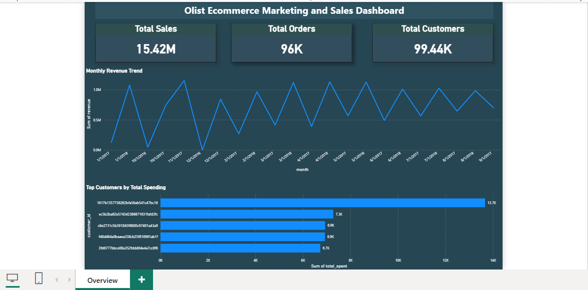

# ecommerce-data-analysis
SQL + Power BI project analyzing e-commerce data (in progress)

**Objective**
To analyze sales performance, customer behavior, and payment trends using SQL and visualize insights using Power BI.

**Problem Statement**
- Analyze e-commerce data to uncover trends in sales, customer behavior, and payment patterns to support business decision-making.

**Tools Used**
- MySQL
- Power BI

**Project Structure**
- sql_queries :SQL scripts for analysis.
- dashboard :Power BI dashboard screenshots.

**Work Done So Far**
- Imported dataset into MySQL.
- Performed joins between orders, customers, and payments.
- Revenue and order trend analysis.
- Built interactive Power BI dashboard.

**Key Insights**
- Total revenue shows a steady growth trend over time with peak sales during festive periods.
- Majority of orders are concentrated in a few key states, indicating regional demand clusters.
- Credit card is the most preferred payment method among customers.
- Late deliveries are associated with lower customer satisfaction (based on delivery vs estimated time).
- A small percentage of customers contribute to a large portion of total revenue (high-value customers).

**Dashboard Preview**

**Status: In Progress**
