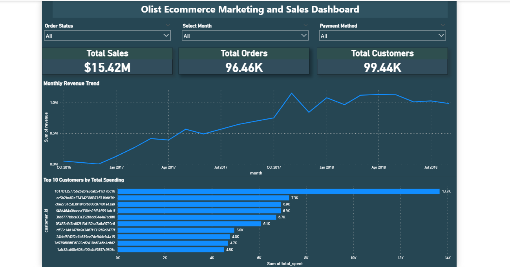
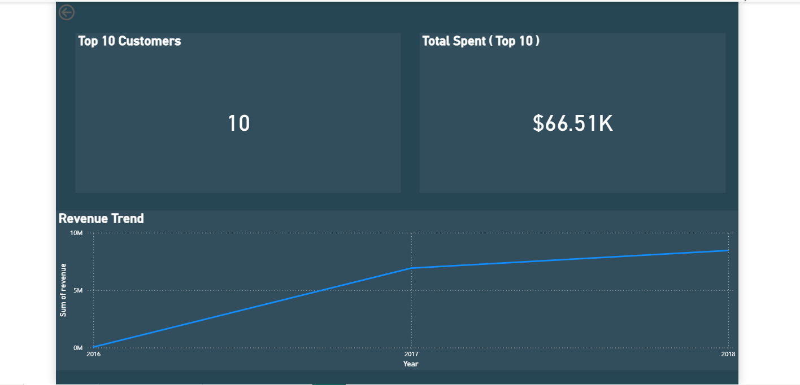
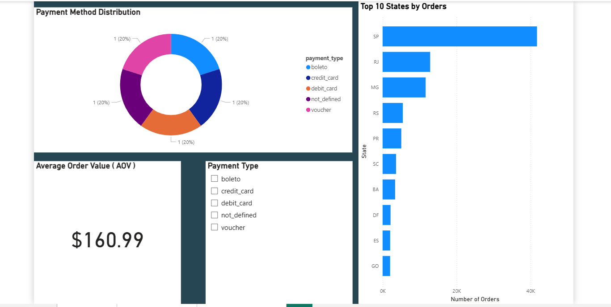

# 📊 E-commerce Data Analysis (SQL + Power BI)

## > Objective

To analyze e-commerce data and uncover insights related to sales performance, customer behavior, and payment trends using SQL and Power BI.

---

## > Problem Statement

Analyze large-scale e-commerce transaction data to identify patterns in revenue, customer purchasing behavior, and payment preferences to support data-driven business decisions.

---

## > Tools & Technologies

* MySQL
* Power BI
* DAX
* Data Modeling

---

## > Project Structure

* `sql_queries/` → SQL scripts for data extraction and analysis
* `dashboard/` → Power BI dashboard screenshots
* `ecommerce_dashboard.pbix` → Interactive dashboard file

---

## > Work Done

* Imported and cleaned e-commerce dataset (~100K+ records) in MySQL
* Performed joins across multiple tables (orders, customers, payments)
* Analyzed revenue trends and order patterns using SQL queries
* Built an interactive Power BI dashboard with KPI cards and filters
* Created DAX measures including Average Order Value (AOV)

---

## > Key Metrics

* **Total Sales:** $15.42M
* **Total Orders:** 96K
* **Total Customers:** 99.44K
* **Average Order Value (AOV):** $160.99

---

## > Key Insights

* Revenue shows a consistent upward trend over time
* A few states contribute the majority of total orders
* Credit cards are the most preferred payment method
* High-value customers generate a large portion of revenue
* Delivery delays impact customer satisfaction

---

## > Dashboard Features

* KPI Cards (Sales, Orders, Customers, AOV)
* Monthly Revenue Trend
* Top 10 Customers
* Payment Method Distribution
* Top 10 States by Orders
* Interactive filters

---

## > How to Use

1. Download the `.pbix` file
2. Open in Power BI Desktop
3. Interact with filters

---

## > Dashboard Preview

### 🔹 Overview Dashboard

### 🔹 Top Customers Analysis

### 🔹 Business Insights

---

## > Power BI Dashboard File

You can download and explore the full interactive dashboard here:

> [Download PBIX File](powerbi/ecommerce_dashboard.pbix)

